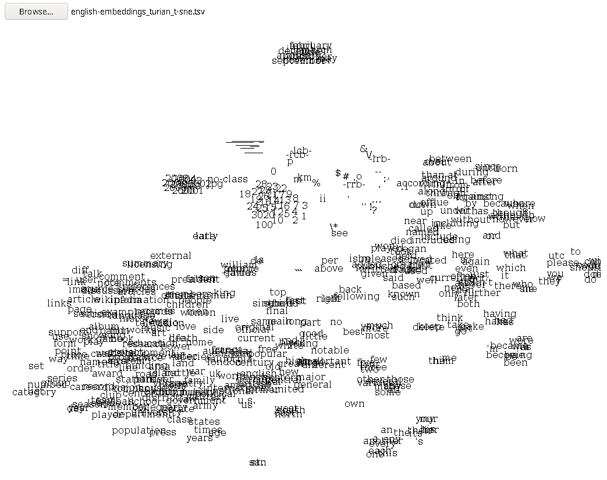

# picard #

    To boldly go to the final frontiers of your word spaces

## Development ##

You need the following:

* [Coffee Script][coffee]
* A way to serve web pages
* A modern standards-compliant web browser

[coffee]: http://coffeescript.org/

Once you have installed the above dependencies:

* Clone this repository
* Enter the directory and run: `coffee --watch --output src/js src/coffee`
* Get hacking!
